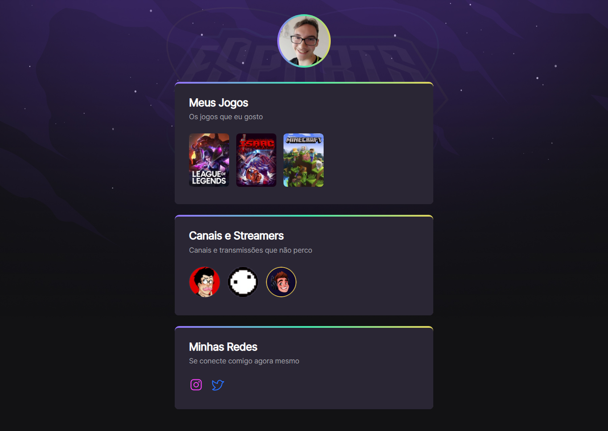

# NLW eSports

>Trilha Explorer

Projeto construído no evento Next Level Week da Rocketseat

[Clique aqui para acessar](https://gabrieltrois.github.io/nlw-esports-explorer)

## Tecnologias
 - HTML
 - CSS
 - Git e Github

 ## O que aprendi
  - A criação e estruturamento de um site 
  - Utilizar [Hyperlinks](https://developer.mozilla.org/pt-BR/docs/Learn/Common_questions/What_are_hyperlinks)
  - Organizar informações de um site
  - Criar animações usando CSS
 

 ## Contato

 anddabanddab@gmail.com